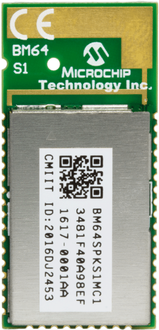

# BM64_GETTING_STARTED
> “Wireless Made Easy!" - BM64 Getting Started with Stereo (DSPK) and Multi-speaker (MSPK) modes

The BM64 is a fully-certified Bluetooth 5.0 Audio module for designers who want to add Bluetooth wireless audio and voice applications to their products.
 
**This guide demonstrates the Stereo mode (single speaker or dual speaker: Mono Left and Mono Right) and Multi-speaker mode (two or more speakers).**

<a href="https://www.microchip.com" target="_blank">

&nbsp;&nbsp;&nbsp;&nbsp;&nbsp;&nbsp;&nbsp
<a href="https://www.microchip.com/bm64" target="_blank">

</a>

1. [Discover our Technologies](#step1)

	1. [Introduction to BM64](#step1a)
	1. [Class 1 or Class 2](#step1b)
    1. [Stereo or Multi-speaker](#step1c)
1. [Overview of our Solutions](#step2)
    1. [Select a speaker](#step2a)
	1. [Smartphone Apps](#step2b)
	1. [Evaluation board](#step2c)
	1. [Evaluate Stereo Mode (DSPK)](#step2d)
	1. [Evaluate Multi-speaker Mode (MSPK)](#step2e)
	
1. [Select the device you need](#step3)
1. [Develop with BM64](#step4)
1. [Additional ressources](#step5)

## Discover our Technologies 

### Introduction to BM64 

The BM64 is certified Bluetooth 5.0 dual-mode module.
- Bluetooth Classic: BDR/EDR low-level transport layer for audio or voice streaming and SPP for data exchange (provisioning).
- BLE transport for proprietary transparent service to provide a BLE substitute for the Serial Port Protocol (SPP) of classic Bluetooth for use with an Apple® iPhone®, which does not support SPP. 
(audio commands for working with Android and iOS)
 

**About Bluetooth Audio Technology:**
- Highly popular technology found everywhere including smartphone, consumer and professional products along IoT
- It refers to 2 technologies
    - Bluetooth Classic : focus on continuously streaming data. Typical use case is Audio with a specific Bluetooth Audio profile called A2DP
    - Bluetooth Low Energy (BLE) : focus on sending bulks of data while optimizing power consumption. Highly popular in IoT
- Key things to know about Bluetooth Classic (… and Audio)
    - It takes more than Bluetooth to support Audio : audio products typically are dual mode bluetooth (Classic + BLE) with embedded MCU and DSP for audio processing. This is what Microchip proposes !
    - A2DP profile could support different music codecs to compress the music files into bit-rates that could then be broadcasted thru Bluetooth
    - Popular codecs :  low-complexity sub-band codec (SBC), Advanced audio coding (AAC), Sony’s proprietary codecs (LDAC)
    - Microchip has BM64 solutions supporting SBC, AAC and LDAC.
    - Microchip has solutions for Stereo and Multi speakers, True Wireless earbuds, headsets and headphones
 

### Class 1 or Class 2 

Two options are proposed to our customers:
- the BM64 Class 2 module comes with +2 dBm (typical) output power (headset or mono/stereo speaker) (see DSPK firmware) 
- the BM64 Class 1 module comes with +15 dBm (typical) output power to fulfill applications requesting higher range, well suited for 
multi speaker applications (see MSPK firmware).
 

### Stereo or Multi-speaker 

Two additional options: 
The BM64 module can be configured with one of these two firmware versions.

- DSPK firmware is able to stream A2DP music to one speaker (mono) or two speakers (Stereo mode: mono left and mono right).
- MSPK firmware is able to stream A2DP music to multiple speakers from one audio source such as a smartphone.
MSPK refers also to Microchip Wireless Concert Technology (WCT).
 

## Overview of our Solutions 

### Select a speaker 

To evaluate our Bluetooth audio solutions, we've compiled a list of possible speakers compatible with BM64 Evaluation Board.

-> **Good, compact speaker for High Resolution demo:**
<ul>
<li>
Bose Companion 20:

</li>
 

<li>
Eltax MONITOR I: 

</li>
 

<li>
KRK RP6G3:

</li>
</ul>
 

-> **Simple, light and small speakers for our BM64 EVB demo (not High Resolution):**
    Ideal for mobility and demonstration purpose.
<ul>
<li>
Small 5W speakers from AliExpress:

</li>
</ul>
 

### Smartphone Apps 

Microchip provides a smartphone App called MBA (Microchip Bluetooth Audio) supporting both Android 6.0 (or higher) and iOS 10.0 (and higher device).
 
Mobile Application discovers BLE devices and filters the Microchip Audio devices (BM64 based) and communicates with them over Microchip’s Proprietary BLE Service called Transparent Service.
This Mobile Application can be used for Stereo (DSPK) or Multi-speaker (MSPK) audio applications.
 
MBA is available as code sources and as an App in the respective stores.
- The source code of the App for Android and iOS are available to download and both come come along with MSPKv1.35 Software Package (located into "Software\Source Code" folder):
<a href="http://ww1.microchip.com/downloads/en/DeviceDoc/BM64%20Software%20&%20Tools%20(MSPKv1.35).zip" target="_blank">http://ww1.microchip.com/downloads/en/DeviceDoc/BM64%20Software%20&%20Tools%20(MSPKv1.35).zip</a>
- The Android version of the MBA app is available from the Google Play™ store:
<a href="https://play.google.com/store/apps/details?id=com.app.microchip.audiowidget&hl=en" target="_blank">https://play.google.com/store/apps/details?id=com.app.microchip.audiowidget&hl=en</a>
- The iOS version is available in the iTunes® store:
<a href="https://apps.apple.com/us/app/microchip-bluetooth-audio/id1309473719" target="_blank">https://apps.apple.com/us/app/microchip-bluetooth-audio/id1309473719</a>

### Evaluation board 

BM64 Class 1 Evaluation board: <a href="https://www.microchip.com/DevelopmentTools/ProductDetails/PartNO/BM-64-EVB-C1" target="_blank">BM-64-EVB-C1</a>
 
BM64 Class 2 Evaluation board: <a href="https://www.microchip.com/DevelopmentTools/ProductDetails/PartNO/BM-64-EVB-C2" target="_blank">BM-64-EVB-C2</a>
 

Kit contains: 

&nbsp;&nbsp;&nbsp;&nbsp;&nbsp;&nbsp;&nbsp;

### Evaluate Stereo Mode (DSPK) 

Application Note <a href="http://www.microchip.com//wwwAppNotes/AppNotes.aspx?appnote=en604469" target="_blank">AN2614</a> introduces DSPK Technology, gives you guidelines to setup then operate your development board in Stereo mode using MBA App or the EVB keyboard (using only MFB key).
 

**This demo is based on DSPK 2.1.2 Firmware. First, update the PIC18 MCU Code, BM64 Firmware and EEPROM parameters by following the steps as described in AN2614.**
**As a general information, it is strongly recommended to update every single items (MCU code, BM64 Firmware, BM64 EEPROM, ..) from the same Software Package and do not mix the software.**
 
Resources: 
- <a href="http://www.microchip.com//wwwAppNotes/AppNotes.aspx?appnote=en604469" target="_blank">AN2614 - Bluetooth Dual Mode Speaker Audio Application</a>
- <a href="http://ww1.microchip.com/downloads/en/DeviceDoc/DSPK%20v2.1.2%20package.zip" target="_blank">DSPK 2.1.2 Software package</a>
- <a href="https://www.youtube.com/watch?v=Eq4SjI17xPE" target="_blank">BM64 FW and EEPROM update video</a>

Setup of the environment with basic speakers and smartphone: 

&nbsp;&nbsp;&nbsp;&nbsp;&nbsp;&nbsp;&nbsp;

&nbsp;&nbsp;&nbsp;&nbsp;&nbsp;&nbsp;&nbsp;

In below example (video), the BM64-EVB is powered up via a short press on MFB key (blue light) then ready to pair thru long press to the MFB key (blue and red lights toggle).

### Evaluate Multi-speaker Mode (MSPK) 

Application Note <a href="http://www.microchip.com//wwwAppNotes/AppNotes.aspx?appnote=en604702" target="_blank">AN2645</a> introduces MSPK Technology, gives you guidelines to setup then operate your development boards in Multi-Speaker mode using MBA App or the EVB keyboard (using only 2 keys, MFB and SW22).
 

**This demo is based on MSPK 1.35 Firmware. First, update the BM64 Firmware and EEPROM parameters by following the steps as described in AN2645.**
 
Resources: 
- <a href="http://www.microchip.com//wwwAppNotes/AppNotes.aspx?appnote=en604702" target="_blank">AN2645 - Bluetooth Multi-Speaker Audio Application</a>
- <a href="http://ww1.microchip.com/downloads/en/DeviceDoc/BM64%20Software%20&%20Tools%20(MSPKv1.35).zip" target="_blank">MSPK 1.35 Software package</a>
- <a href="https://www.youtube.com/watch?v=Eq4SjI17xPE" target="_blank">BM64 FW and EEPROM update video</a>

Setup of the environment with basic speakers and smartphone: 

 
In below example (video), a first board is paired to your smart phone (same procedure explained earlier in paragraph 2.4, "Evaluate Stereo Mode (DSPK)"), 
then configured as MASTER, thru long press to the SW22 key (blue light).
Other boards are then powered up (pressing MFB key) and then join the network here again after long press to the SW22 key.
Connecting after the MASTER, they join as SLAVE (RED light).
 

Up to 35 BM64 speakers have been chained together at trade shows such as CES based on our BM64 Speaker Reference Design from one of our partner.
 

&nbsp;&nbsp;&nbsp;&nbsp;&nbsp;&nbsp;&nbsp;

## Select the device you need 

Just select the device you need from the following link: <a href="https://www.microchipdirect.com/product/search/all/bm64" target="_blank">Buy BM64</a>
 

Every BM64 modules comes with common feature set: 
Surface mount module with  
Package Size   : 32 x 15 x 2.5 mm 
Lead Count     : 43 
Temp Range     : -20C to +70C 
Op Voltage Min : 3.2V 
Op Voltage Max : 4.2V 

Here the ordering information: 

**BM64SPKA1MC2-0001AA** 
Without RF shield  
Certification : CE 
Class 2 module with +2 dBm (typical) output power 
Mono/Stereo Speaker firmware (DSPK) - Version 1.1  
 
**BM64SPKS1MC2-0001AA** 
With RF shield  
Certification : CE, FCC, IC, MIC, KCC, NCC, SRRC, ANATEL  
Class 2 module with +2 dBm (typical) output power  
Mono/Stereo Speaker firmware (DSPK) - Version 1.1  
 
**BM64SPKA1MC1-0001AA**  
Without RF shield 
Certification : CE 
Class 1 module with +15 dBm (typical) output power 
Mono/Stereo Speaker firmware (DSPK) - Version 1.1  
 
**BM64SPKS1MC1-0001AA**  
With RF shield 
Certification : CE, FCC, IC, MIC, KCC, NCC, SRRC 
Class 1 module with +15 dBm (typical) output power 
Mono/Stereo Speaker firmware (DSPK) - Version 1.1  
 
**BM64SPKS1MC1-00M2AA** 
With RF shield 
Certification : CE, FCC, IC, MIC, KCC, NCC, SRRC 
Class 1 module with +15 dBm (typical) output power 
Multi-Speaker firmware (MSPK) - Version 1.35 - Microchip’s Wireless Concert Technology (WCT) 

## Develop with BM64 

todo